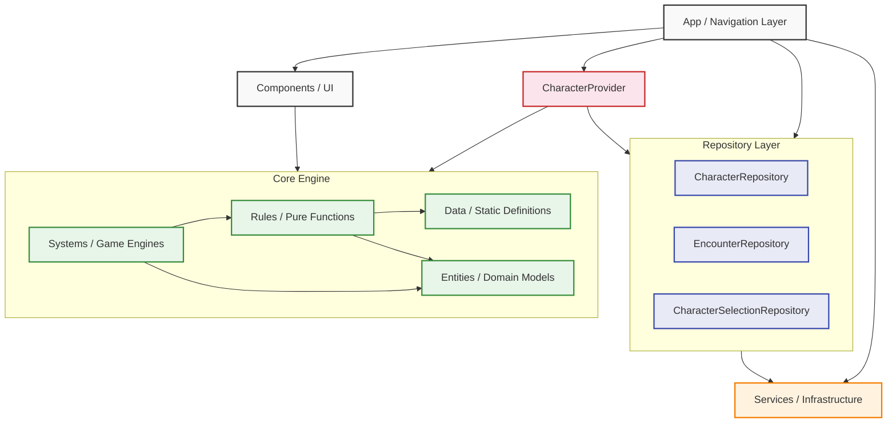

# System Architecture

The D&D Companion utilizes a modular, layered clean architecture design. This separates the presentation layer (UI) from the infrastructure and isolates the core D&D game logic into an independent engine.

## High-Level Dependency Graph

The following diagram illustrates how the architectural layers interact. Crucially, the `Core` engine acts as a standalone library devoid of React or UI dependencies.



## Layer Definitions

### 1. App (`src/app`)

Handles application routing, navigation stacks (using Expo Router), and global providers. It dictates _where_ a user goes. Screens receive their data from the `CharacterProvider` context rather than reading from repositories directly.

### 2. CharacterProvider (`src/utils/character-provider.tsx`)

The runtime join layer between the `Character` record and the `EncounterState`. Responsible for:

- Loading the character from `CharacterRepository` on mount.
- Loading or bootstrapping the character's encounter from `EncounterRepository`.
- Hydrating `character.combatState` from `encounter.participants[characterId]` before passing data to screens.
- Exposing `saveCharacter` and `saveEncounter` so screens can persist mutations through the correct repository without direct storage access.

All combat screens consume data exclusively through `useCharacter()`, which returns `{ character, encounter, saveCharacter, saveEncounter, loading }`.

### 3. Repository Layer (`src/repositories`)

Abstractions over AsyncStorage, one per domain entity. They are the only layer permitted to read from or write to persistent storage directly.

| Repository | Responsibility |
|---|---|
| `CharacterRepository` | CRUD for the `Character[]` list |
| `EncounterRepository` | CRUD for `EncounterState` records, keyed by encounter ID; lookup by participant character ID |
| `CharacterSelectionRepository` | Persists the currently selected character ID |

Repositories are plain objects with async methods. They contain no business logic and no React dependencies.

### 4. Services (`src/services`)

External infrastructure integrations such as localization (`i18n`). Storage access goes through repositories, not directly through services.

### 5. Components (`src/components/ui`)

Reusable, stateless UI atoms and molecules (Buttons, Text, Cards). They receive data and callbacks as props and contain no storage or navigation logic.

### 6. Core Engine (`src/core`)

The isolated D&D Engine. Its architecture guarantees that the game mechanics can be tested, simulated, or exported to a backend server without any React dependencies.

- **Entities** (`src/core/entities/`): Pure TypeScript types only. Zero logic, zero functions. Defines the shapes that data conforms to and that the engine operates on. If every function in the project were deleted, entities would still compile and make sense.
- **Data** (`src/core/data/`): Concrete instances of entity types — the registered templates, static game content, and scaling tables. Still no logic, but contains the specific D&D content (class templates, feature templates, option templates, etc.).
- **Rules** (`src/core/rules/`): Pure functions that compute things. Takes state/templates as input, returns derived values or new state. No side effects, no React, no storage.
- **Systems** (`src/core/systems/`): Orchestrators that apply state transformations over time, spanning multiple rules calls (`StatResolver`, `CombatEngine`, `ModifierEngine`).

### Layer boundary rules

| What it is | Layer | Path pattern |
|---|---|---|
| Type or interface defining a shape | `entities/` | `entities/rules/thing-template.ts` or `entities/character/thing-instance.ts` |
| Static D&D content (a specific feature, option, pool) | `data/` | `data/rules/options/{class}/thing.ts` |
| Registry (lookup by id, homebrew extension point) | `data/registries/` | `data/registries/things.registry.ts` |
| Pure function (calculate, build, resolve) | `rules/` | `rules/character/things-helper.ts` |
| Multi-step orchestration, side effects | `systems/` | `systems/combat/thing-system.ts` |

## Key Architectural Rule: State Ownership

`CombatState` is owned by `EncounterState`, not by `Character`. The `Character` record stored in AsyncStorage does not contain `combatState`. It is injected at runtime by the `CharacterProvider` after loading the encounter. This means:

- Screens read `character.combatState` freely — the provider guarantees it is populated by the time any screen renders.
- Screens must **not** call `saveCharacter` to persist combat state changes (action economy, round tracking, runtime modifiers). Those go through `saveEncounter`.
- Screens must **not** construct `EncounterState` inline. The provider owns encounter construction and lifecycle.

## Key Architectural Rule: Dual-Source Feature Pipeline

A character's active capabilities (actions, resources, modifiers) are derived from two independent sources that feed the same resolution pipeline:

1. **Class/subclass levels** — `getFeaturesFromClasses(character.classes)` walks `featuresByLevel` on each class and subclass template up to the character's current level. This is deterministic and read-only.
2. **Direct character features** — `getFeaturesFromCharacter(character.features)` resolves `FeatureInstance` records held directly on the character. This covers homebrew feats, racial features, training features, and any capability granted outside the class level pipeline.

Both sources produce `FeatureTemplate[]` which feed into the same `grants` resolution pipeline (`buildCharacterClassResources`, `buildCharacterClassActions`, `buildCharacterPassiveModifiers`). A homebrew feature granting `cunning_action` is resolved identically to the Rogue class feature — no special cases.

`getActiveFeatures(character)` is the single entry point that merges both sources. All build functions call this rather than reading `character.classes` directly.

## Key Architectural Rule: Feature Grants

`FeatureTemplate` expresses what a feature provides through a single `grants?: FeatureGrant[]` array rather than parallel optional arrays. The `FeatureGrant` discriminated union currently supports:

```ts
type FeatureGrant =
  | { type: "resource"; id: string }
  | { type: "action"; id: string }
  | { type: "modifier"; id: string }
  | { type: "choice"; id: string }; // references a ChoicePoolTemplate id
```

This design means adding a new grant kind (e.g. `{ type: "spell" }`) requires a one-line addition to the union and a new filter in the relevant helper — no structural changes to `FeatureTemplate` itself.

## Key Architectural Rule: Optional/Selectable Features

Features that offer a pool of options the character picks from (Fighter Maneuvers, Eldritch Invocations, Metamagic, Fighting Styles) are modeled through three cooperating types:

- **`ChoicePoolTemplate`** — defines the pool: which options it contains, how many picks the character gets at each level, and when selection happens (`onLevelUp`, `onLongRest`, `onShortRest`, `onActivation`).
- **`OptionTemplate`** — defines a single selectable option: what it grants (actions, resources, modifiers), and which pools it belongs to (`poolIds: string[]` — an option can belong to multiple pools, e.g. fighting styles shared across Fighter/Paladin/Ranger/Swords Bard).
- **`ChoiceInstance`** — runtime character state recording which options have been selected from a given pool, stored on `character.featureChoices` keyed by `poolId`.

The `selectionTrigger` on a pool is a UI default, not an engine constraint. The engine enforces nothing about when choices can be changed — all selections are always editable, supporting homebrew and table-rule overrides.

Options resolve through `choices-helper.ts` which produces ID sets (`getResourcesFromChoices`, `getActionsFromChoices`, `getModifiersFromChoices`) that merge into the same build pipeline as feature grants. The resolution step is identical regardless of whether a capability came from a class feature or a player-selected option.