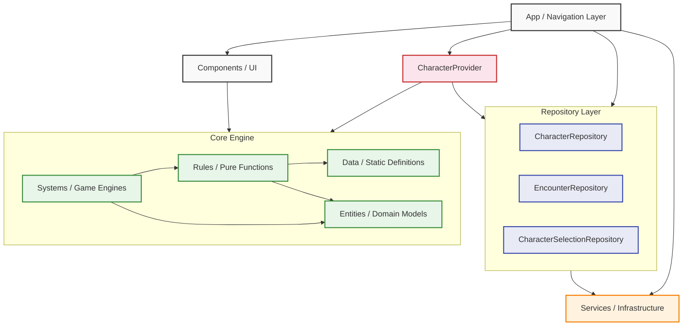

# System Architecture

The D&D Companion utilizes a modular, layered clean architecture design. This separates the presentation layer (UI) from the infrastructure and isolates the core D&D game logic into an independent engine.

## High-Level Dependency Graph

The following diagram illustrates how the architectural layers interact. Crucially, the `Core` engine acts as a standalone library devoid of React or UI dependencies.

## Layer Definitions

### 1. App (`src/app`)

Handles application routing, navigation stacks (using Expo Router), and global providers. It dictates _where_ a user goes. Screens receive their data from the `CharacterProvider` context rather than reading from repositories directly.

### 2. CharacterProvider (`src/utils/character-provider.tsx`)

The runtime join layer between the `Character` record and the `EncounterState`. Responsible for:

- Loading the character from `CharacterRepository` on mount.
- Loading or bootstrapping the character's encounter from `EncounterRepository`.
- Hydrating `character.combatState` from `encounter.participants[characterId]` before passing data to screens.
- Exposing `saveCharacter` and `saveEncounter` so screens can persist mutations through the correct repository without direct storage access.

All combat screens consume data exclusively through `useCharacter()`, which returns `{ character, encounter, saveCharacter, saveEncounter, loading }`.

### 3. Repository Layer (`src/repositories`)

Abstractions over AsyncStorage, one per domain entity. They are the only layer permitted to read from or write to persistent storage directly.

| Repository | Responsibility |
|---|---|
| `CharacterRepository` | CRUD for the `Character[]` list |
| `EncounterRepository` | CRUD for `EncounterState` records, keyed by encounter ID; lookup by participant character ID |
| `CharacterSelectionRepository` | Persists the currently selected character ID |

Repositories are plain objects with async methods. They contain no business logic and no React dependencies.

### 4. Services (`src/services`)

External infrastructure integrations such as localization (`i18n`). Storage access goes through repositories, not directly through services.

### 5. Components (`src/components/ui`)

Reusable, stateless UI atoms and molecules (Buttons, Text, Cards). They receive data and callbacks as props and contain no storage or navigation logic.

### 6. Core Engine (`src/core`)

The isolated D&D Engine. Its architecture guarantees that the game mechanics can be tested, simulated, or exported to a backend server without any React dependencies.

- **Data**: Static registries (Classes, Actions, Resources, Scaling rules).
- **Entities**: TypeScript types representing domain state (`Character`, `EncounterState`, `CombatState`).
- **Rules**: Pure functions that compute D&D math (`getArmorClass`, `getProficiencyBonus`, `resolveInCombat`).
- **Systems**: Orchestrators that apply state transformations over time (`StatResolver`, `CombatEngine`, `ModifierEngine`).

## Key Architectural Rule: State Ownership

`CombatState` is owned by `EncounterState`, not by `Character`. The `Character` record stored in AsyncStorage does not contain `combatState`. It is injected at runtime by the `CharacterProvider` after loading the encounter. This means:

- Screens read `character.combatState` freely — the provider guarantees it is populated by the time any screen renders.
- Screens must **not** call `saveCharacter` to persist combat state changes (action economy, round tracking, runtime modifiers). Those go through `saveEncounter`.
- Screens must **not** construct `EncounterState` inline (e.g. `buildEncounterState([character])`). The provider owns encounter construction and lifecycle.