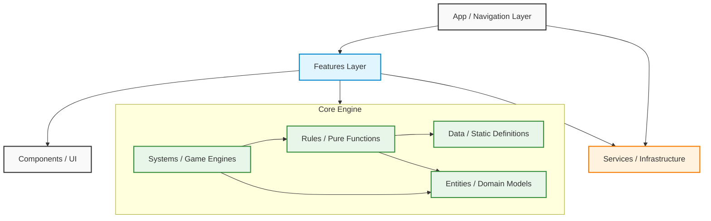

# System Architecture

The D&D Companion utilizes a modular, 4-layer clean architecture design. This separates the presentation layer (UI) from the infrastructure and isolated the core D&D game logic into an independent engine.

## High-Level Dependency Graph

The following diagram illustrates how the architectural layers interact. Crucially, the `Core` engine acts as a standalone library devoid of React or UI dependencies.

## Layer Definitions

### 1. App (`src/app`)

Handles application routing, navigation stacks (using Expo Router), and global providers. It dictates _where_ a user goes.

### 2. Features (`src/features`)

Feature-driven modules (e.g., `character-sheet`, `combat-tracker`). These compose complex views using `Components`, interact with `Services`, and dispatch actions to the `Core` engine.

### 3. Services (`src/services`)

External infrastructure integrations, such as local storage, localization (`i18n`), and potentially future cloud syncing protocols.

### 4. Components (`src/components/ui`)

Dumb, reusable, stateless UI atoms and molecules (Buttons, Text, Cards) built strictly according to the design system.

### 5. Core Engine (`src/core`)

The isolated D&D Engine. Its architecture guarantees that the game mechanics can be tested, simulated, or even exported to a backend server without any React dependencies.

- **Data**: Static registries (Spell lists, Classes, Base Items).
- **Entities**: TypeScript Types and Interfaces (`Character`, `CombatState`) that represent the state of the world.
- **Rules**: Pure functions that compute D&D math (`calculateArmorClass`, `getProficiencyBonus`).
- **Systems**: Complex orchestrators that modify state over time (`StatResolver`, `CombatEngine`).
