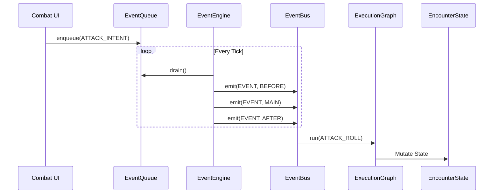
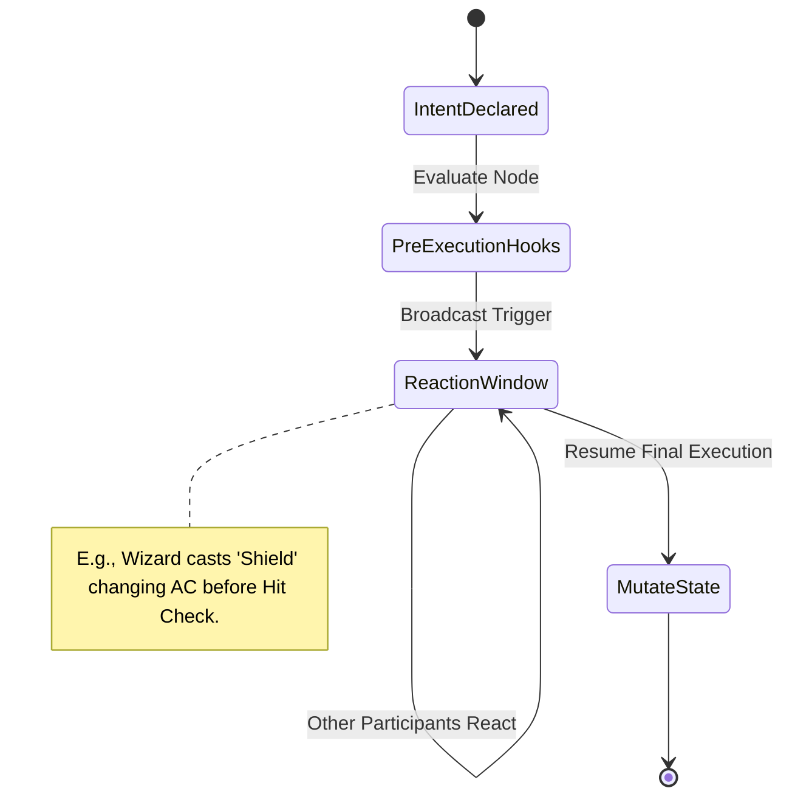
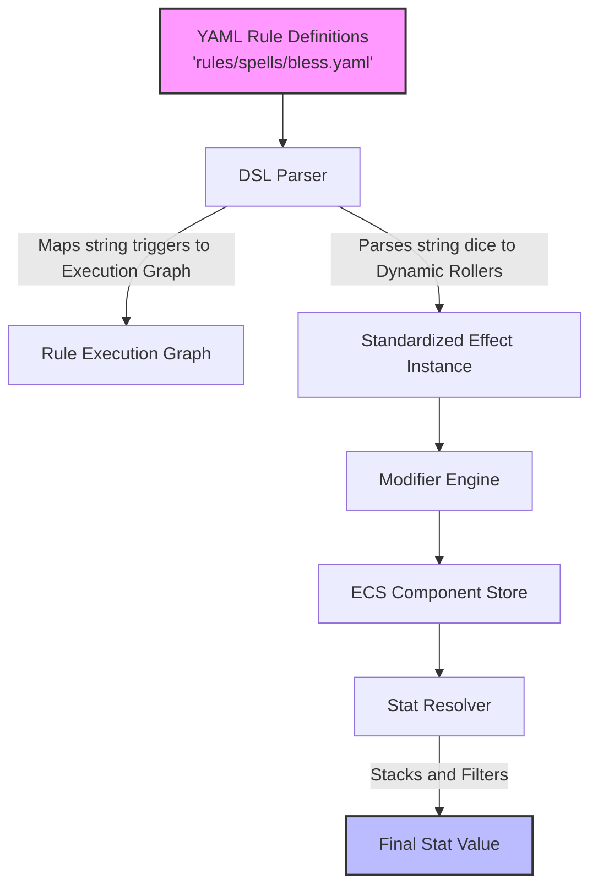

# Combat Engine Architecture

The Combat Engine is the core orchestrator for combat encounters in the D&D Companion application. It utilizes a highly decoupled, data-driven, and event-oriented architecture inspired by standard VTTs (Virtual TableTops) and Entity-Component-Systems (ECS).

## Key Components

1. **Encounter State**: The central atomic state mapping all turns, active participants, rounds, and system triggers.
2. **Event Queue & Bus**: Replaces direct function calls with an asynchronous, deterministic tick loop processing events in `BEFORE`, `MAIN`, `AFTER` phases.
3. **Execution Graph**: Evaluates combat actions (e.g., Attack Rolls, Saves) through a node-based interceptor graph rather than hardcoded `if/else` logic.
4. **Intent Resolver & Reactions**: Defers state mutations by building `CombatIntent`s first, allowing systems like _Counterspell_ or _Shield_ to pause the execution and evaluate conditional logic.
5. **ECS Hybrid Component Store**: Modifiers and active effects are mapped globally via an $O(1)$ ECS dictionary structure to scale for large encounters without processing overhead.

## UML Diagrams

### 1. Unified Event Flow (Event Bus + Execution Graph)

### 2. Action Intent Resolution (Reaction Windows)

### 3. Rules DSL to Effect Engine Pipeline

## Best Practices & Guidelines

- **Never directly mutate `EncounterState`**. All transitions should occur by mapping a data payload, enqueueing it into the `EventQueue`, and letting the `CombatEngine` natively drain and process the state.
- **Modifiers tick on `TURN_START`**. Avoid modifying expiration boundaries around `TURN_END` to ensure single-round durations do not collapse immediately upon casting.
- **Use the Conflict Resolver for Tie-breakers**. Do not write hardcoded exceptions (e.g., `if (mageArmor && unarmoredDefense)`). Instead, add a mutual exclusion rule dynamically via the DSL's `conflicts` array mapping.
- **Maintain "Pure" Data Entities**. The classes governing `Modifier`, `Duration`, and `Event` should contain zero behavior algorithms.
