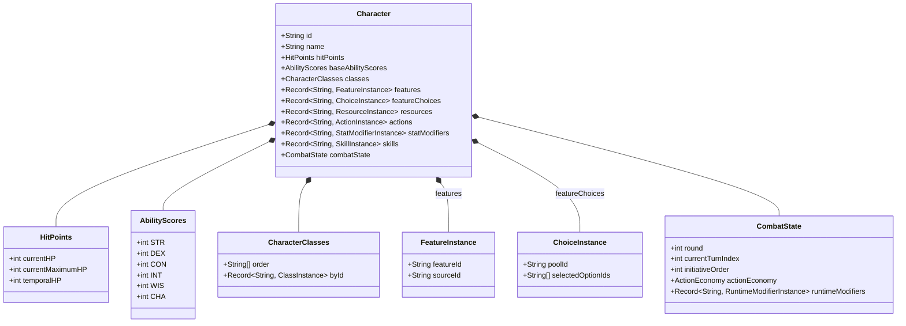
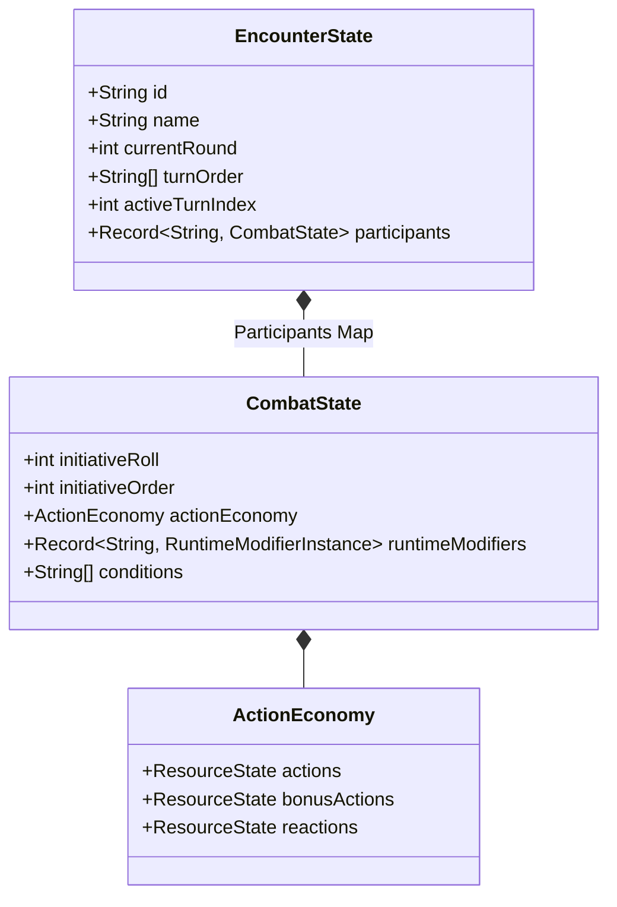
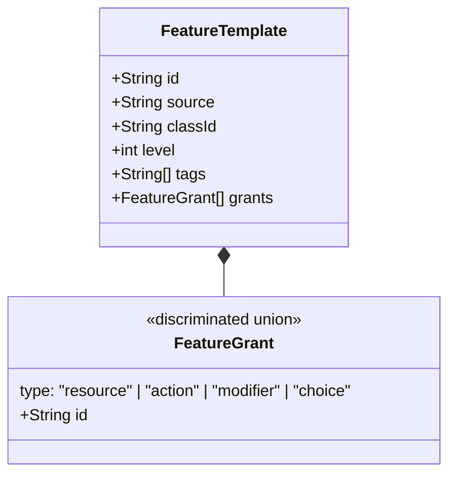
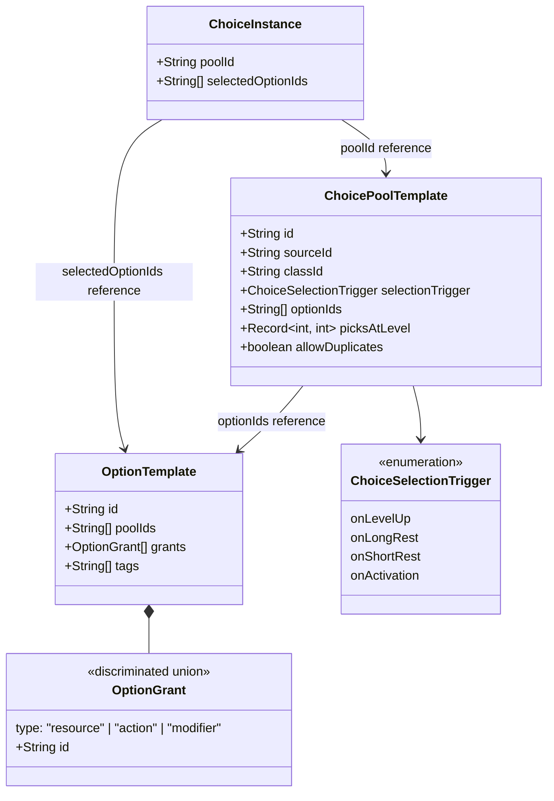
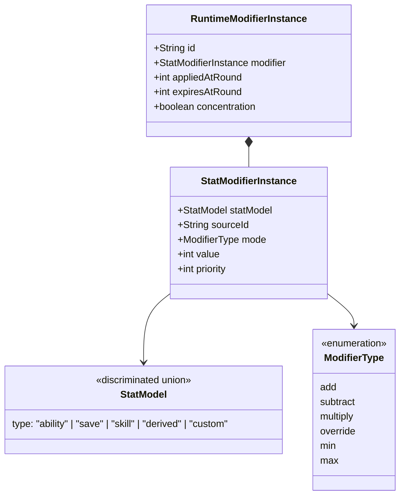

# Domain Model

This document outlines the core business entities within the `src/core/entities` engine.

## The Character Entity

The central object representing a player or NPC. It aggregates various sub-domains into a single serializable state.

### Feature Pipeline

A character's active capabilities (actions, resources, modifiers) derive from two sources merged before resolution:

1. **Class/subclass levels** — features from `CharacterClasses` walked up to current level.
2. **Direct character features** — `character.features` holds `FeatureInstance` records for homebrew feats, racial features, training features, or any capability granted outside the class level pipeline.

Both sources produce `FeatureTemplate[]` which feed the same grant resolution pipeline. A homebrew feature is resolved identically to a class feature.

### Choice Pipeline

`character.featureChoices` records which options the character has selected from each pool, keyed by `poolId`. The `choices-helper.ts` functions resolve these selections into the same ID sets (resources, actions, modifiers) that feed the build pipeline — the resolution step is identical to feature-granted capabilities.

All selections are always editable regardless of the pool's `selectionTrigger`. The trigger is a UI default, not an engine constraint.

---

## The Encounter Entity

Manages a group of participants running through the Combat Engine lifecycle.

`CombatState` is owned by `EncounterState`, not by `Character`. It is injected into `character.combatState` at runtime by `CharacterProvider` and must never be persisted as part of the `Character` record.

---

## The Feature System

Features are the mechanism by which classes, subclasses, races, feats, and homebrew content grant capabilities to a character. Features are a byproduct — they exist to grant actions, resources, modifiers, and choice pools. They are not first-class mechanical actors.

---

## The Option System

For features that offer a pool of selectable options (Fighter Maneuvers, Eldritch Invocations, Metamagic, Fighting Styles), three cooperating types model the full lifecycle from pool definition to character selection.

**Key design decisions:**

- `OptionTemplate.poolIds` is a string array — an option can belong to multiple pools (e.g. `fighting_style_defense` is valid for Fighter, Paladin, Ranger, and Swords Bard). Each class defines its own pool with its own `optionIds` subset enforcing the restriction.
- `OptionGrant` excludes `{ type: "choice" }` — options cannot grant further choice pools, preventing circular resolution.
- Shared options (fighting styles, etc.) live in `src/core/data/rules/options/shared/` and are imported only by the root `options.ts` aggregator.

---

## The Modifier System (Base)

The foundation for the Universal Modifier System, dictating how dynamic changes are applied to character stats.

### Known Issues

Two stacking rule bugs exist and must be resolved before conditions and spell effects are implemented:

- `override` behaves like `overlap` — allows multiple instances instead of replacing.
- `ignore` does not prevent modifier injection — should short-circuit the entire application when an existing instance of the same template is already active.