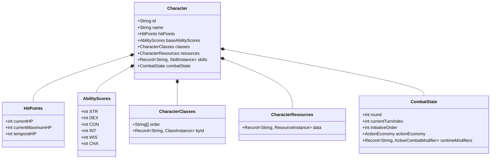
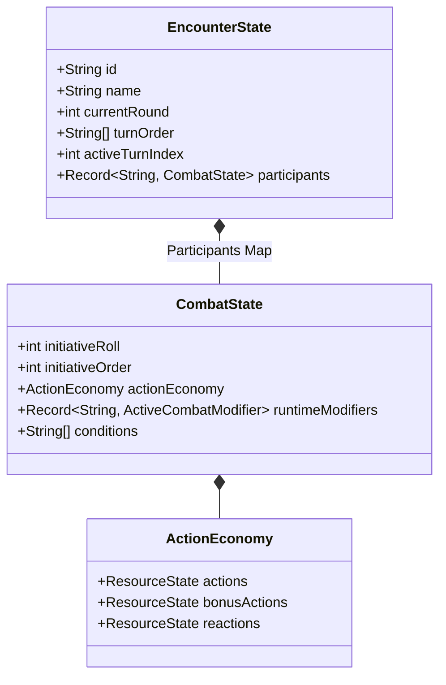
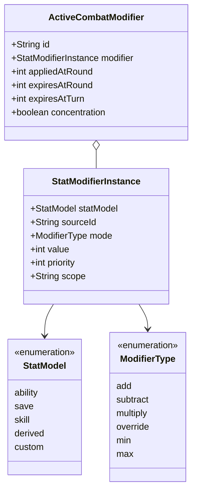

# Domain Model

This document outlines the core business entities within the `src/core/entities` engine.

## The Character Entity

The central object representing a player or NPC. It aggregates various sub-domains into a single serializable state.

## The Encounter Entity

Manages a group of participants running through the Combat Engine lifecycle.

## The Modifier System (Base)

The foundation for the Universal Modifier System, dictating how dynamic changes are applied to character stats.

