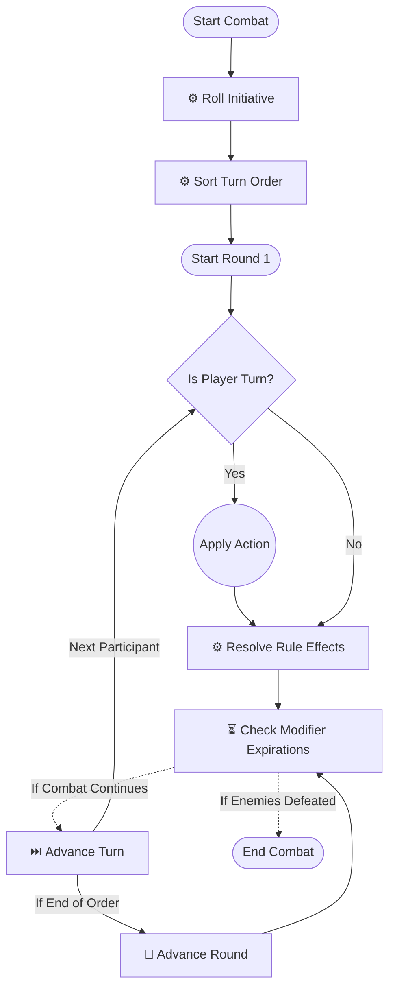
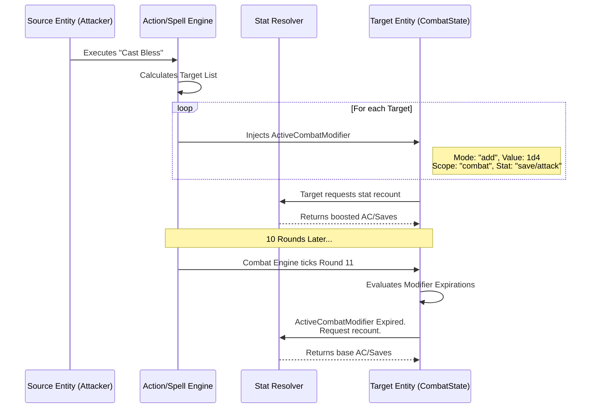

# Core Engine Mechanics

This document details the critical flows within the isolated `src/core` D&D Engine. Understanding these lifecycles is crucial for implementing new rules, spells, or combat features.

## 1. Combat Engine Lifecycle

The `EncounterState` manages the flow of time and turns in combat. This diagram illustrates the state machine from initialization to resolution.



> **Action shape:** `ActionInstance` uses
> `board: ActionBoard[]`, `duration: ActionDuration`, and
> `trigger?: ActionTrigger[]` instead of the legacy `actionSlot` field.
> Concentration on `ApplyModifierEffect` and `RuntimeModifierInstance`
> is tracked via `concentration?: boolean` but cap enforcement and
> out-of-combat concentration handling are not yet implemented.
> See `src/core/entities/actions/action-instance.ts` for the current shape.

## 2. Character Stat Resolution Diagram

The `StatResolver` (`src/core/systems/stats`) is responsible for calculating a character's final numbers by combining their base stats with active modifiers.

```mermaid
flowchart TD
    subgraph OutOfCombat [Passive Stats (Out of Combat)]
        BaseScores[(Base Ability Scores)]
        Proficiency[(Proficiency Bonus)]
        Features[(Class/Race Features)]

        BaseAC[Calculate Base AC]
        BaseHP[Calculate Base HP]
        BaseSkills[calculate Base Skills]
    end

    subgraph ModifierSystem [Modifier Injection]
        Items[Equipped Items]
        PersistentBuffs[Persistent Buffs]
        CombatBuffs[Active Combat Run-time Modifiers]
    end

    subgraph Resolution [Stat Resolver Engine]
        Gather[1. Gather All Modifiers for StatX]
        Sort[2. Sort by Priority]

        MathAdd[3a. Apply Adds/Subtracts]
        MathMult[3b. Apply Multipliers]
        MathOverride[3c. Apply Overrides]
        MathClamp[3d. Apply Min/Max Clamps]

        Final[4. Output Final Resolved Stat]
    end

    BaseScores --> BaseAC
    BaseScores --> BaseHP
    BaseScores --> BaseSkills

    BaseAC --> Gather
    BaseHP --> Gather
    BaseSkills --> Gather

    Items --> Gather
    PersistentBuffs --> Gather
    CombatBuffs --> Gather

    Gather --> Sort
    Sort --> MathAdd
    MathAdd --> MathMult
    MathMult --> MathOverride
    MathOverride --> MathClamp
    MathClamp --> Final
```

## 3. Universal Modifier Stacking System

Modifications to a Character's state are handled asynchronously via `ActiveCombatModifier` structures. This shows how an attack or spell cascades into a state change.


