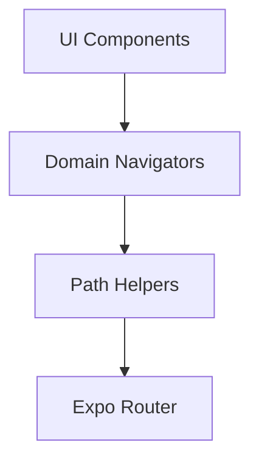

# Navigation Architecture

This document details the navigation system implemented in DnD-Companion, built on **Expo Router** and following **Clean Architecture** principles.

## 1. Layered Structure

Navigation does not happen directly within UI components. It follows a top-down flow to ensure separation of concerns:



1. **UI Component**: Calls a domain-specific navigation hook (e.g., `useCombatNavigator`).
2. **Domain Navigator**: Contains the business logic for the transition (e.g., which IDs to pass, which states to reset).
3. **Path Helpers**: Pure functions that generate Expo Router URLs from parameters.
4. **Expo Router**: Processes the URL and renders the corresponding screen.

## 2. Route Definitions (Paths)

Routes are centralized in `src/navigation/paths.ts` to avoid hardcoded strings:

```typescript
export const Paths = {
  home: "/" as const,
  characterCreation: "/character-creation" as const,
  characterEdition: "/character-edition" as const,
  // Dynamic Routes
  combat: (id: string) => `/combat/${id}/tab-stats` as const,
  combatTab: (id: string, tab: CombatTab) => `/combat/${id}/${tab}` as const,
};
```

## 3. Domain Navigators

Instead of using `useRouter()` directly, each domain has its own hook in `src/navigation/navigators/`:

- **`useCharacterNavigator`**: Handles creation, edition, and back flows.
- **`useCombatNavigator`**: Handles entering combat for a specific character and switching between combat tabs.

**Benefit**: If the file structure in `app/` changes, you only need to update the navigator or the path helper, not every component.

## 4. Source of Truth (Stateless Navigation)

The system is designed to support **Deep Linking**. The source of truth for a screen is its **URL**, not the global state.

- **Route**: `/combat/[characterId]/tab-stats`
- The `TabLayout` component extracts `characterId` using `useLocalSearchParams`.
- The `CharacterProvider` loads data from the repository using that ID.

This allows a user to enter directly via a URL (e.g., from a notification or link), and the app will function correctly without depending on the Zustand state being initialized by a previous screen.

## 5. Performance Optimizations

In `app/combat/[characterId]/_layout.tsx`, the following native optimizations are used:

- **`lazy: true`**: Combat tabs (Stats, Actions, Resources, etc.) load into memory only when first accessed.
- **Icon Component Isolation**: Icon components are defined outside the layout's main render loop to prevent re-renders and React warnings.

## 6. Production Best Practices

To ensure stability in production, the following advanced patterns are implemented:

### Hydration Guard

Zustand's storage hydration is asynchronous. To prevent race conditions during cold starts, the root `_layout.tsx` includes a **Hydration Guard**:

```tsx
const hasHydrated = useCharacterStore((s) => s.hasHydrated);
if (!hasHydrated) return <View style={{ flex: 1 }} />;
```

### Navigator Memoization

Custom domain navigators are wrapped in `useMemo` to prevent unnecessary re-renders in components that use them as dependencies.

```tsx
export const useCombatNavigator = () => {
  const router = useRouter();
  return useMemo(() => ({ ... }), [router]);
};
```
